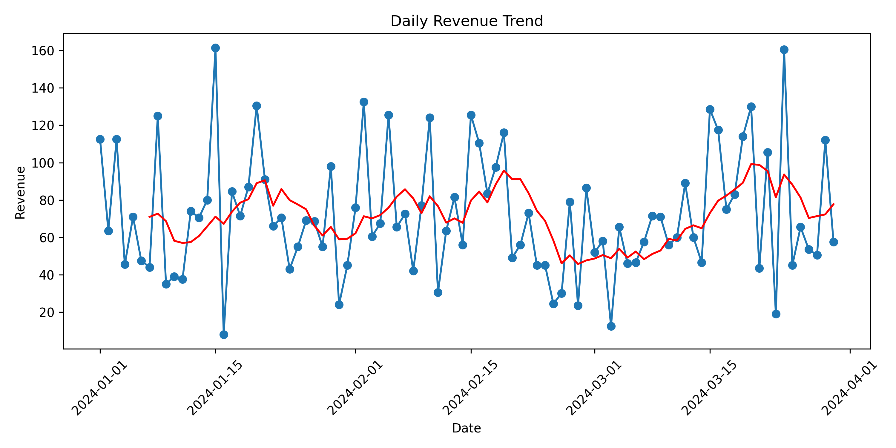
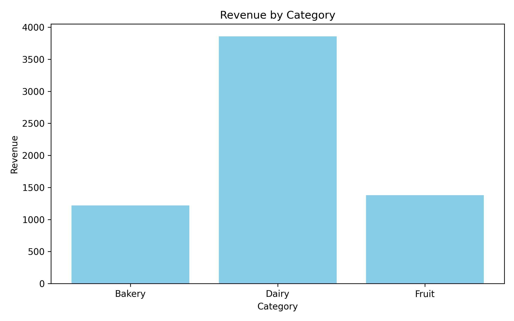

# E-Commerce Sales Analytics Pipeline

## Overview
This project simulates an end-to-end sales data pipeline using Python, Pandas, NumPy, and Matplotlib.
It extracts raw sales data, cleans and transforms it, computes daily and category-level metrics, and visualizes trends.





## Features
- ETL pipeline: Extract → Transform → Aggregate → Load
- 7-day rolling averages for daily revenue trends
- Aggregated CSV outputs for downstream analytics
- Data validation and logging for pipeline reliability
- Professional, reproducible code structure

## Technologies
- Python
- Pandas, NumPy, Matplotlib

## Usage
1. Generate synthetic data:
   ```bash
   python generate_data.py
